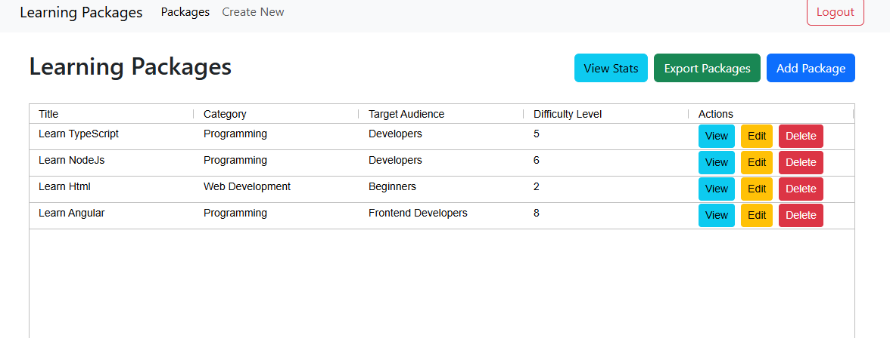
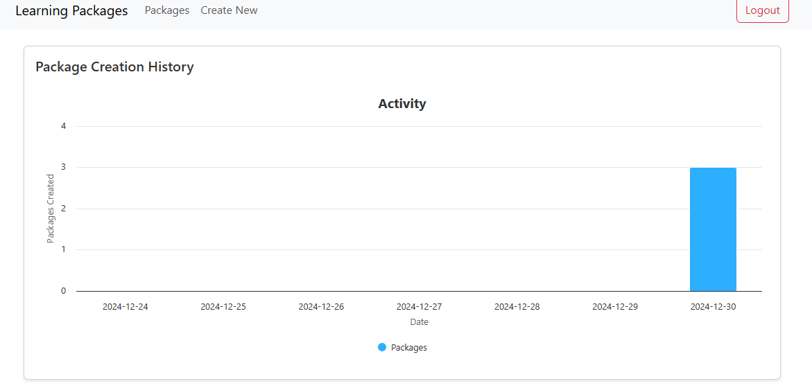

# Learning Packages Management System

A full-stack web application for managing learning packages with real-time statistics and export capabilities.

# Prerequisite
A Postgre database

name: 'LearningFactDb'

user with all priviledges: 'learningDbUser'

password : 'password'

## Quick Start

1. Start the backend:
```bash
cd backend
npm install
npm run dev
```

2. Start the frontend (in a new terminal):
```bash
cd frontend
npm install
ng serve
```

## Demo Account

You can connect with the demo account 
```
Username: demo
Password: demo123
```

## Development

The application uses:
- Frontend dev server: `http://localhost:4200`
- Backend API: `http://localhost:3000`
- Swagger: `http://localhost:3000/api-docs` 

## Architecture Overview

### Frontend (Angular)

#### Core Components
- **Login**: User authentication interface


- **Signup**: User registration interface


- **Package List**: Main dashboard showing all learning packages using ag-grid
 

- **Package Form**: Create/Edit package interface


- **Package Details**: Detailed package view
 

- **Package Stats**: Activity visualization using Highcharts


#### Services
- **Auth Service**: JWT authentication management
- **Learning Package Service**: Package CRUD operations
- **WebSocket Service**: Real-time export functionality


### Backend (Node.js/Express)

#### API Routes / swagger
- **Auth**: `/api/auth/login`, `/api/auth/signup`
- **Packages**: CRUD operations via `/api/package`
- **Stats**: Activity data via `/api/package/stats/creation-history`


#### WebSocket Features
- Real-time package export to CSV
- Secure socket connections with JWT


## Key Features

1. **Package Management**
   - Create, view, edit, and delete learning packages
   - User-specific package lists
   - Detailed package information

2. **Statistics & Analytics**
   - 7-day activity chart
   - Package creation history
   - Interactive data visualization

3. **Export Functionality**
   - Real-time CSV export via WebSocket
   - Secure data transfer

4. **Security**
   - JWT-based authentication
   - Protected routes
   - User-specific data access

## Technical Stack

### Frontend
- Angular 16+
- Highcharts
- Socket.io-client
- Bootstrap CSS
- Ag-grid

### Backend
- Node.js/Express
- Sequelize ORM
- Socket.io
- Postgre database
- Swagger

## Data Models

### Learning Package
```typescript
interface LearningPackage {
  id?: number;
  title: string;
  description: string;
  category: string;
  targetAudience: string;
  difficultyLevel: number;
  userId: number;
  createdAt?: Date;
}
```

